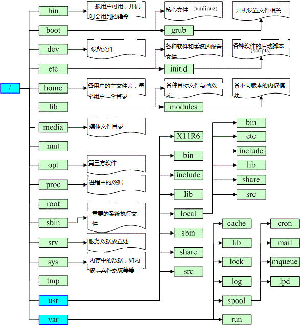
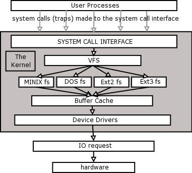
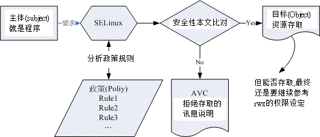
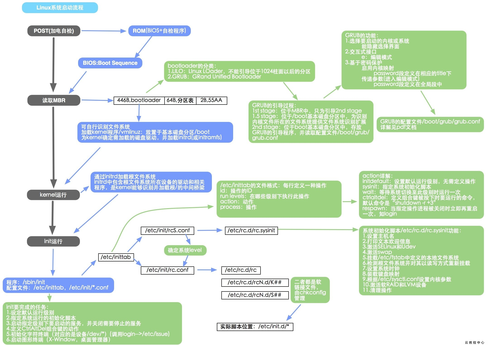
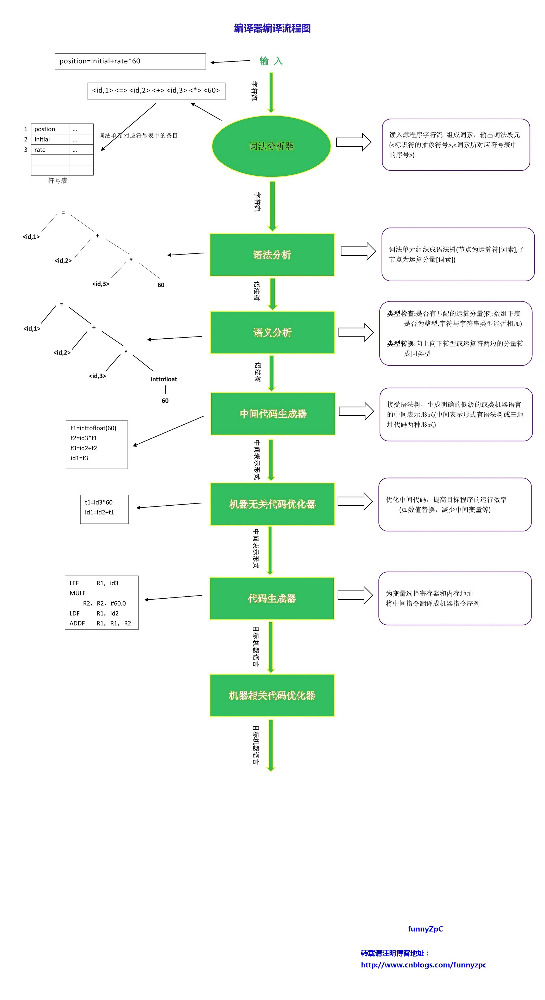
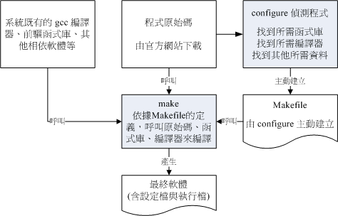
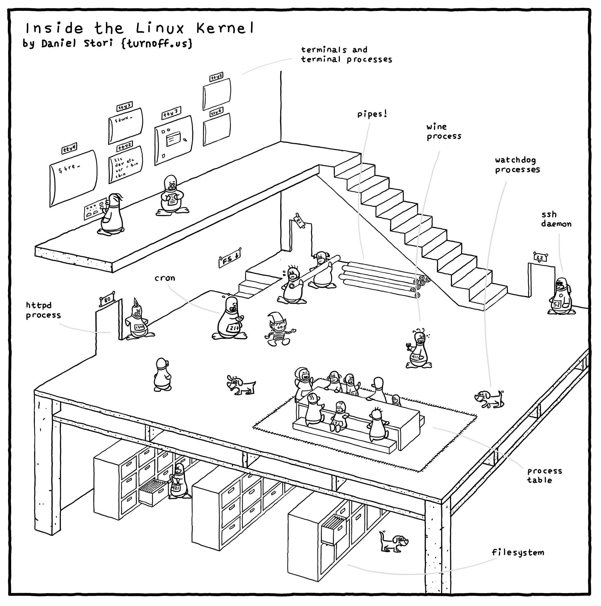

参考 鸟哥的Linux私房菜 基础篇+服务器架设篇

## Linux是什么
- Linux的发展
    - Unix
    - GNU: GNU's Not Unix
        - 重要软件
            - 编辑器：Emacs
            - C编译器：GCC
            - C函式库：glibc
            - 接口：BASH shell
        - 图形接口XFree86计划
            - X Window
    - Free, go, free!
        - 开源软件(open source)
            - GPL 自由软件: General Public License(copyleft)
                - 任何软件使用GPL的全部或部分代码，则该软件就得使用GPL授权
            - Apache License
            - BSD
            - MIT license
            - Mozilla Public License
            - Common Development and Distribution License
        - 专利软件(close source): 可执行的二进制程序
            - 免费使用
                - Freeware
                - Shareware
    - Linux： Linus Benedict Torvalds(just for fun)
        - GPL授权
        - POSIX规范
        - 虚拟团队：`http://www.kernel.org`
        - 核心版本：主版本.次版本.释出版本-修改版本
            - 长期维护(Longterm)
            - 结束开发(End of Live)
        - Linux distribution
            - 标准：LSB + FHS

- Linux应用角色
    - 企业环境
        - 网络服务器
        - 关键任务的应用(金融数据库)
        - 学术机构的高效能运算任务
    - 个人环境
        - 桌面计算机
        - 手持系统
        - 嵌入式系统
    - 云端应用
        - 云程序
        - 端设备

## 主机规划与磁盘分区
- Linux与硬件的搭配
- 磁盘分区
    - MBR vs GPT
    - BIOS vs UEFI
    - 挂载：一个目录当成进入点，将磁盘分区的数据放在该目录上
- 安装前的规划

## 安装 CentOS7.x
- 安装流程
    - 救援
    - 烧机
- 多重引导与管理
    - 开机管理程序

## 首次登入和在线求助
- 首次登入
    - 图形接口桌面：`Ctrl + Alt + F1`
    - 文本模式：`Ctrl + Alt + F2 ~ F6`
        - 切换：`startx`
- 指令下达：`command [-options] param1 param2`
    - 换行：`\`
    - 基础指令：`date`, `cal`, `bc`
    - 热键：`[Tab]`, `[Ctrl]-c`, `[Ctrl]-d`, `[Shift]+[PaUp]`
- **在线求助**
    - `--help`
    - `man`
        - `\(?)string` + `n(N)`
    - `info`
- 文书编辑器：`nano`
- 正确的关机方法：多人多任务

## 文件与目录
- 使用者和群组
    - 帐号：`/etc/passwd`
    - 密码：`/etc/shadow`
    - 组名：`/etc/group`
- 文件权限概念：`-rwxrwx---`
    - 改变文件属性与权限：`chgrp` `chown` `chmod`
    - 目录的权限
        - `r`: `ls`
        - `x`: `cd`
    - 文件种类
        - regular file: `-`
            - 纯文本：`cat`
            - 二进制
            - 数据格式：`last`
        - 目录：`d`   
        - sockets: `s`
        - 数据输送文件(FIFO, pipe):`p`      
- 目录配置
    - FHS
    - 目录树 
        - 根：`/`
        - 软件安装/执行：`/usr`(unix software resource)
            - 软件数据
        - 系统运作(常变动)：`/var`
            - 只能被一个进程占用：`/var/lock/`
        - 指令文件：`/(s)bin`
        - 函数库：`/lib`
    - 系统相关：`uname`
- 目录与文件
    - 目录常用指令：`cd` `pwd` `mkdir` `rmdir`(空) `rm -r`
    - 特殊目录：`.` `..` `-` `~` `~count`
    - 执行文件路径(环境)变量$PATH：`echo $PATH`
    - 文件常用命令：`ls` `cp` `rm` `mv`
    - 文件时间参数：`atime` `ctime` `mtime`
    - 文件名和目录名：`basename`+`dirname`
    - 文件内容查阅：`cat` `tac` `nl`(添加行号) `more` `less` `head` `tail` `od`(二进制)
    - 修改文件时间或建置新档：`touch`
- 默认权限与隐藏权限
    - 新建默认权限：`umask`
    - 文件隐藏属性：`chattr +i(a) file` + `lsattr file`
    - 文件特殊权限：`s`(SUID,SDID, SBIT)
    - 观察文件类型：`file`
- 指令与文件的搜索: 
    - 脚本文件名搜索：`which`
    - 文件档名搜索：`whereis` `locate` `find`

## 磁盘与文件系统管理
- 文件系统
    - 磁盘组成与分区
    - 常见文件系统
        - 传统：EXT2/minix/FAT/MS-DOS/iso9660
        - 日志式：EXT3/EXT4/ReiserFS/Window's NTFS/IBM's JFS/SGI's XFS/ZFS
        - 网络：NFS/SMBFS
    - 文件系统特性 
        - EXT(group): 格式化慢
            - innode：记录文件的属性
            - block：记录文件的内容
            - superblock：记录此filesystem的整体信息
            - 查询指令：`dumpe2fs`
            - 不一致的情况：Journaling filesystem
            - 异步写回磁盘：`sync`
        - XFS：高容量已经高性能
            - data section
            - log section
            - realtime section
- 简单操作
    - 磁盘与目录容量：`df` `du`
    - 链接
        - hard：`ln`
        - Symbolic(快捷方式): `ln -s`
- 磁盘的分区、格式化、检验与挂载
    - 磁盘分区：`gdisk` `parted`
    - 格式化：`mkfs`
    - 检验：`fsck`
    - 设置挂载点：`mount`
- 设定开机挂载：`/etc/fstab`
    - 映像档不刻录就挂载使用：loop挂载
- 内置置换空间(swap)：将内存的程序暂放在硬盘中
- 特殊观察与操作

- 文件与文件系统的压缩、打包、备份
    - 压缩指令
        - `.gz`: `gzip` + `zcat/zmore/zless/zgrep`
        - `.bz2`: `bzip2` + `bzcat/bzmore/bzless/bzgrep`
        - `.xz`: `xz` + `xzcat/xzmore/xzless/xzgrep`
    - 打包指令
        - 压缩：`tar -jcv -f`
        - 查询：`tar -jtv -f`
        - 解压：`tar -jxv -f filename.tar.bz2 -C`
    - XFS文件系统的备份和还原：`xfsdump` `xfsrestore`
    - 光盘写入工具：`mkisofs` `cdrecord`
- 进阶
    - Quota：公平的分配磁盘容量给用户
        - 针对filesystem
    - Software(Hardware) RAID：将多个较小的磁盘整合成较大的磁盘
        - 数据安全与可靠性
        - 读写效能
        - 容量
    - LVM：弹性调整filesystem的容量

## 认识和学习BASH
- shell：与Kernel沟通 `/etc/shells`
    - 默认登录shell：`/etc/passwd`最后一个字段
    - Bash
        - 功能
            - 指令历史`history`:`~/.bash_history`
            - 补全功能`[tab]`
            - 别名设置`alias`
            - 工作控制
            - 脚本
            - 通配符：`* ? [] [-] [^]` 
                - 支持正则表达式的程序：`grep` `sed` `vim`
                    - 文件的格式化
                        - 格式化输出：`printf`
                        - 数据的重新整理和输出：`awk`
                        - 文件比对: `diff` `cmp`
                        - 更新数据：`patch`
        - 内建命令：`type`
        - 变量
            - 取用与设定：`name=zhouh` + `echo ${name}`
            - 取消变量：`unset name`
            - 查看(环境)变量：`set`(`env`)
            - 自定义变量转为环境变量：`export`
            - 语系变量：`locale`
            - 前一个指令执行完毕后的回传值：`$?`
        - 操作环境：`login shell` vs `non-login shell`
            - `etc/profile` + `~/.bash_profile`
            - 读取环境配置文件：`source`
            - 终端的环境设定: `stty` `set`
        - 数据流重导向
            - standard input:`< <<`
            - standard output: `> >>`
            - standard error: `2> 2>>`
            - 连续命令：`&&`
        - 管线命令: `ps | grep`
            - 常见命令：`cut grep sort wc uniq tee tr col join paste expand split xargs`
            - 替代stdin和stdout：`tar -cvf - /home | tar -xvf - -C /tmp/homeback`
- 学习 Shell Scripts
    - 简单范例`hello.sh`
        - 宣告script使用的shell名称：`#!bin/bash`
        - 程序内容的说明：`#`
            - 内容与功能
            - 版本信息
            - 作者与联络方式
            - 建立日期
            - 历史记录
        - 主要环境变量：`PATH=~/bin` `export PATH`  
        - 程序正文：`echo -e "Hello World! \a \n"`
        - 定义回传值：`exit 0`
    - 语法
        - 交互：`read`
        - 每次执行有不同结果：`date`
        - 夫进程执行：`source`
        - 判断：`test` `[]`
        - 函数：`function name(){}`
        - 默认变数：`$0 $1 $2 $@`
        - 条件判断：`if then` `case esac`
        - 循环：`while(until, for) do done` 
        - debug：`sh -x`

## 账号管理与ACL权限设定
- 账号管理
    - 记录：UID(`/etc/passwd`) GID(`/etc/group`)
    - 密码：`/etc/shadow`
    - 命令：`useradd`+`passwd` `groupass`
    - ACL: Acsess Control List
    - 使用者身份切换：`su` `sudo`
    - 验证程序：`PAM`
    - 登入情况：`w` `who` `last` `lastlog`
    - 与使用者交谈：`write` `wall` `mail`
- 例行性工作排程
    - 单一工作
        - `at`
            - 条件：`atd`服务+`/etc/at.deny`使用者帐号
            - 查询与删除：`atq` `atrm`
        - `batch`: CPU负载小于0.8时才进行后续的工作排程
    - 循环工作：`crontab`
        - 排程安排：`crontab -e` + `/etc/crontab`
        - 唤醒停机期间为进行的任务：`anacron` + `/etc/anacrontab`

## 进程管理与SELinux初探
- 程序和进程
    - 父进程
        - 所有进程：`init` `PID=1`
        - 进程呼叫：`fork` + `exec`
    - 服务(daemon):常驻在内存中的进程
        - systemd
            - 服务(unit)类型
                - service
                - socket
                - target
                - path
                - timer
            - 启动/关闭/重启服务：`systemctl [start|stop|restart] unit.service`
            - 设定(不)自启：`systemctl [enable|disable] unit.service`
            - 查询：`systemctl list-units --type=service`
    - 工作管理
        - 前景(foreground)：`Ctrl+z`
        - 背景(background): `jobs` + `hg`
    - 观察指令：`ps` `top` `pstree`
    - 互相控制：`kill -signal`
    - 优先级：`nice`
    - 系统资源使用情况：`vmstat`
- SELinux：避免使用者资源的误用 

- 认识与分析登录档
    - 登录文件`/var/log/`
    - 服务和程序
        - `systemd-journald.service`：最主要的讯息收受者,由 systemd 提供的
        - `rsyslog.service`：主要登录系统与网络等服务的讯息
            - 服务名称`syslog.h`
            - 讯息等级：`info notice warning error critical alert emergency`
            - 登录服务器：`/etc/rsyslog.conf`
        - `logrotate`：主要在进行登录文件的轮替功能
    - 分析软件：`logwatch`

- 开机流程、模块管理与Loader 
  - Boot loader: Grub2

- 基础系统设定与备份策略
  - 系统基本设定
      - 网络：IP + Netmask + gateway + DNS服务器
      - 日期和时间
      - 语言
      - 防火墙
  - 硬件数据收集
      - 解析硬件设备：`dmidecode`
      - 收集和分析
          - 分区表列出：`gdisk -l`
          - 核心运行过程中各项讯息记录：`dmesg`
          - 系统(CPU/RAM/IO)状态：
              - 当前：`vmstat`
              - 实时：`iostat`
          - PCI接口装置：`lspci`
          - USB装置：`lsusb`
      - 磁盘的健康状态：`smartctl `
  - 备份
      - 策略
          - 累计备份
          - 差异备份
      - 常用工具： `dd` `cpio` `tar` `xfsdump`

## 软件安装
- 源码安装
    - Tarball：压缩的具有原始码的文件
        - 编译过程  
        - 指令：`make` 
        - 函式库
            - 动态函式库：`.so`
            - 静态函式库：`.a`
        - 更新源码：`patch`
        - 检查：`MD5/SHA1/SHA256`
    - 软件管理员：厂商预先编译
        - 软件管理机制：RPM vs DPKG
        - 使用指令：`rpm` vs `dpkg`
        - 在线升级(解决属性相依问题)：`yum` vs `apt`
            - 软件群组：`yum groupinstall`
 
## Linux 核心编译与管理
- 核心：`/lib/modules/$(uname -r)/kernel/` 

## 服务器架构

- 架设前的准备
    - 连上Internet
    - 常用网络命令
        - 设定：`ifconfig`
        - 路由修改：`route`
        - 综合：`ip address show` + `ip route show`
        - 无线网络：`iwlist` `iwconfig`
        - DHCP：`dhclient`
        - 两主机沟通：`ping`
        - 两主机各节点分析：`traceroute`
        - 本机的网络联机和端口：`netstat`
        - 主机名和IP: `host` `nslookup`
        - 远程联机与实时通讯
            - 终端与BBS(明码):`telnet`
            - FTP联机软件：`ftp` `lftp`
            - 文字接口网页浏览：`links`
            - 文字接口下载器：`wget`
            - 封包截取：`tcpdump` `wireshark`(图形接口)
            - 启动TCP/UDP封包的端口联机：`nc` `netcat`
    - 网络侦错
        - 原因分析
            - 硬件
            - 软件
        - 处理流程
            - 网卡
            - 局域网内各项连接设备
            - IP参数
            - 路由表
            - DNS
            - NAT服务器或IP分享器
            - Internet
            - 服务器

- 局域网架构
    - 局域网内常见服务器架设
        - 远程连接服务器SSH/XDMCP/VNC/RDP
        - 网络参数掌控者DHCP
        - 文件服务器：NFS, SAMBA
            - NFS(UnixLike)
            - SAMBA(Windows&Linux)
        - 账号控管：NIS服务器
        - 时间服务器：NTP服务器
        - 区网控制者：Proxy服务器
        - 网络驱动器装置：iSCSI服务器

- 互联网服务器架设
    - 常见服务器
        - 主机控制者：DNS服务器
        - WWW服务器
        - 文件服务器：FTP服务器
        - 邮件服务器：Postfix

- 主机的安全防护措施
    - 网络安全与主机基本防护
        - 限制端口
        - 网络升级
        - SELinux
    - 路由观念与路由器设定
    - 防火墙与NAT服务器
    - 申请合法的主机名
