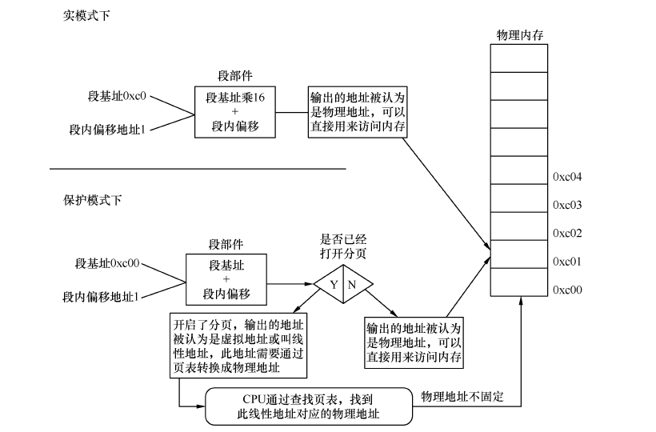

参考 操作系统真象还原 郑钢

## 一些问题
- 是什么
    - 重复性劳动集中在一起
- 从哪里开始
    - 假定给硬件一个输入，硬件就会返回一个输出
- 写操作系统，哪些需要我来做
    - 分层
    - 了解硬件
- 软件如何访问硬件
    - 将某个外设的内存映射到一定范围的地址空间中
    - 通过I/O接口与CPU通信
- 应用程序是什么
    - 语言
    - 编译器
- 什么是陷入内核
    - 用户程序访问系统资源
- 内存访问为什么要分段
    - 两个编译出来地址相同的程序无法同时运行
    - 段基址+段内偏移地址：程序中指令的地址改为另外一个地址，但该地址的内容不变
- 代码中为什么分为代码段、数据段
    - 给他们赋予不同的属性
    - 提高CPU内部缓存的命中率
    - 节省内存
- 地址的区别：
    - 物理
    - 有效(逻辑)
    - 线性(虚拟)
- 什么是段重叠
- 什么是平坦模型
- cs、ds这类的serg段寄存器，位宽是多少
- 什么是工程
    - 开发一套软件所需要的全部文件
        - 实际代码
            - 自己
            - 同事
            - 第三方
        - 环境配置
            - 模板
            - 库文件目录
            - 服务器地址
- 为什么不同系统上应用软件不能兼容
    - 可执行程序格式不一致
    - API不同
- 局部变量和函数参数为什么要放在栈中
    - 浪费空间
- 为什么说汇编语言比C语言快
    - 高级语言为了通用性，需要加入额外代码
- 先有的语言还是先有的编译器
    - 先有编程语言
    - 第一本书是怎么产生的：人的记忆
- 编译型程序与解释型(脚本)程序的区别
    - 脚本中的代码不会在CPU上执行
    - CPU眼中只有脚本解释器
- 什么是大端字节序、小端字节序
- BIOS终端、DOS中断、Linux中断的区别
- section和Segment的区别
- 什么是魔数
    - 出现一个数字，不明白其意思，但结合上下文就明白了
- 操作系统如何识别文件系统
    - 文件系统的魔数
- 如何控制CPU的下一条指令
    - 程序计数器
- 指令集、体系结构、微架构、编程语言
    - 指令集：具体的一套指令编码
    - 微架构：指令集的物理实现方式
- 库函数是用户进程与内核的桥梁
- 转义字符与ASCII码
- MBR、EBR、DBR、OBR各是什么
    - 计算机系统的控制权

## 部署工作环境

## 编写MBR主引导记录

## 保护模式入门

## 保护模式进阶，向内核迈进

## 完善内核

## 中端

## 内存管理系统

## 线程

## 输入输出系统

## 用户进程

## 进一步完善内核

## 编写硬盘驱动程序

## 文件系统

## 系统交互
