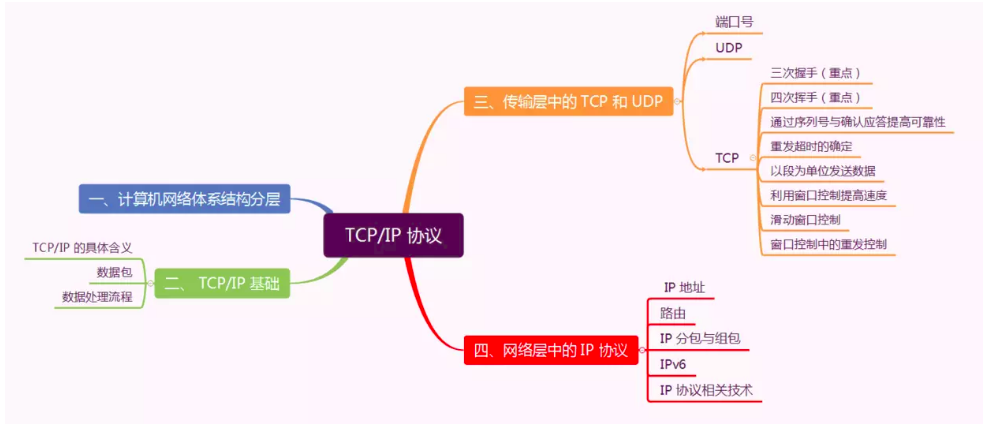
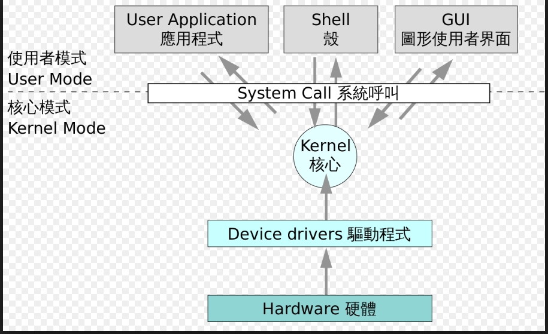

## 内容介绍
- [计算机硬件](OS/hardware.md)(预备)
    - 历史
        - 史前时代
        - 电子管时代: ENIAC
        - 晶体管时代: Fortran
        - 中小规模集成电路时代: Basic
        - 大规模和超大规模集成电路时代: RISC
        - 人工智能, 大数据和云服务的结合
    - 冯·诺依曼体系结构: 将程序（指令序列的集合）和数据存放在同一存储器的不同地址的电脑设计概念结构
- [TCP/IP协议](TCP_IP/network.md) 
    - 基础结构发展的三个阶段
        - 单个网络ARPANET向互连网(internet)发展
            - 互联网(Internet)：互连网+TCP/IP协议
        - 三级结构的互联网(NSFNET):主干网,地区网,校园(企业)网
        - 多层次ISP结构的互联网: 主干ISP, 地区ISP, 本地ISP
    - 科学上网
        - Host
        - VPN
        - SSR
    - 虚拟机实现桥接连接
- [操作系统](OS/os.md)(预备) 
    - 历史
        - 无操作系统
            - 手工
            - 脱机输入/输出方式
        - 单道批处理系统—晶体管
        - 多道批处理系统
            - 中断技术
            - I/O处理机
        - 分时系统
        - 实时系统
        - 网络操作系统
        - 分布式操作系统
        - 多处理机系统
        - 嵌入式操作系统
    - [Linux系统](OS/Linux/linux.md)
        - Open source: Free, go, free !

